<div align="center">

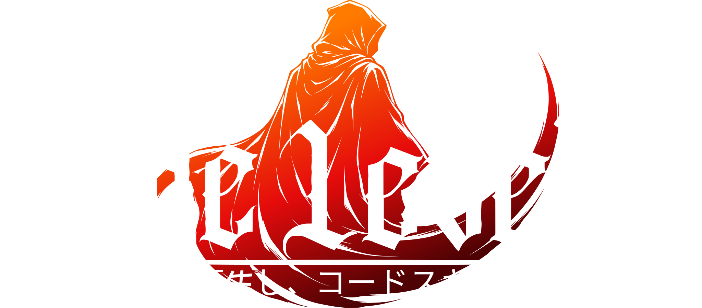

### *Reencarnei em Outro Mundo e Maximizei Minha Code Skill*

**O RPG Online Acadêmico de Programação nas Dimensões C e C# (Unity Engine 6.5), com Duelos PVP, Abismo de Algoritmos, Sistema Gacha de Cards Colecionáveis, Boss Raids Cooperativas e Forja de Artefatos.**

[-00599C?style=for-the-badge&logo=c&logoColor=white)](https://en.wikipedia.org/wiki/C_(programming_language))
[](https://docs.unity.com/)
[](https://developer.mozilla.org/pt-BR/)
[](https://firebase.google.com/)
[](https://github.com/rennan101/GuildCode)

</div>

---

## 🌟 Visão Geral & O Multiverso das Duas Dimensões

**CODE LEVELER** é uma plataforma educacional imersiva que transforma o aprendizado e domínio da engenharia de software em um épico RPG de turno. O universo do jogo é dividido em dois planos dimensionais interconectados:

1. **Dimensão da Linguagem C (Plano Astral de Aethelgard — 16 Capítulos):**
   - O reino dos fundamentos sagrados: I/O de baixo nível (`printf`/`scanf`), operadores lógicos, estruturas de decisão, laços, vetores, matrizes, algoritmos clássicos de ordenação, ponteiros arcanos, alocação dinâmica de memória (`malloc`/`free`), structs e árvores binárias.
2. **Dimensão C# & Unity 6.5 (Plano Tecnológico NexusCore — 38 Capítulos & 9 Módulos):**
   - O reino da arquitetura de jogos e orientação a objetos: POO aplicada a games, ciclo de vida do Unity (`Awake`, `Start`, `Update`), GameObjects, componentes e hierarquias, física 2D/3D (`Rigidbody`, colliders, raycasting), padrões de projeto para games (Singleton, State Machine, Observer), ScriptableObjects, UI Toolkit, corrotinas assíncronas e shaders/efeitos visuais com C#.

<div align="center">
  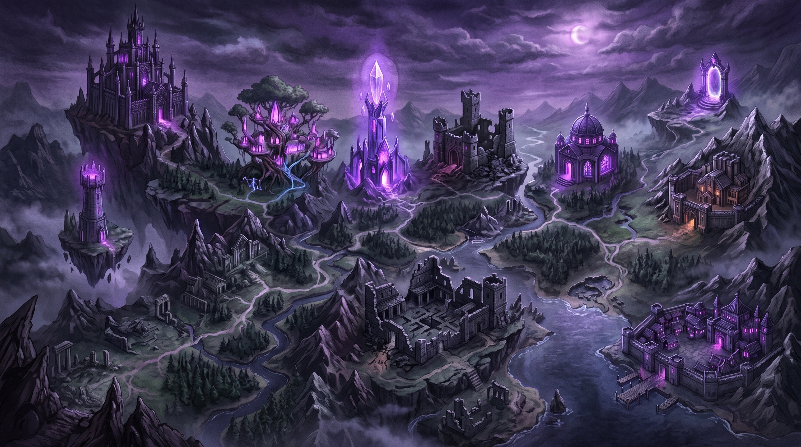
  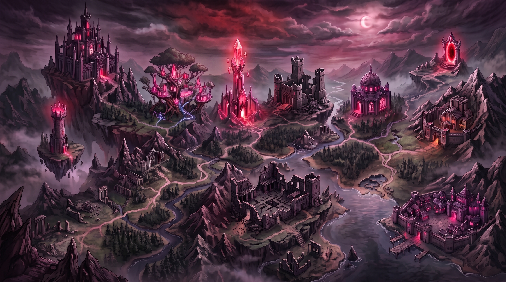
</div>

---

## 🔮 1. Portal de Invocação Gacha & Avatares da Temporada

O sistema de convocação dimensional abriga **24 Avatares oficiais** distribuídos entre as raridades Comum (3★), Raro (4★), Épico (5★) e Lendário (6★). Cada espírito canaliza uma habilidade passiva exclusiva com impacto direto nas masmorras, economia de tokens, duelos PVP e Raids.

> *Passe o mouse sobre o carrossel para pausar a rotação contínua.*

<div align="center">
<div style="overflow: hidden; width: 100%; max-width: 900px; padding: 20px 0; mask-image: linear-gradient(to right, transparent 0%, black 8%, black 92%, transparent 100%); -webkit-mask-image: linear-gradient(to right, transparent 0%, black 8%, black 92%, transparent 100%);">
  <div style="display: flex; gap: 20px; width: max-content; animation: scrollAvatars 40s linear infinite;">
    <!-- Avatar 01: Shadow Coder -->
    <div style="width: 250px; flex-shrink: 0; background: linear-gradient(180deg, #18152e 0%, #0c0a18 100%); border: 2px solid #fbbf24; border-radius: 14px; padding: 14px; box-shadow: 0 10px 25px rgba(251, 191, 36, 0.25); text-align: center; color: #fff;">
      <div style="font-size: 11px; letter-spacing: 1px; color: #fbbf24; font-weight: 800; margin-bottom: 6px;">LEGENDARY ★★★★★★</div>
      
      <h4 style="margin: 8px 0 2px; color: #f8fafc; font-size: 16px;">Shadow Coder</h4>
      <div style="font-size: 11px; color: #94a3b8; margin-bottom: 8px;">Mestre das Sombras</div>
      <div style="display: grid; grid-template-columns: repeat(4, 1fr); gap: 4px; font-size: 10px; background: rgba(0,0,0,0.4); padding: 5px; border-radius: 6px; margin-bottom: 8px; font-weight: 700;">
        <span style="color: #4ade80;">HP 750</span>
        <span style="color: #f87171;">ATK 195</span>
        <span style="color: #38bdf8;">DEF 110</span>
        <span style="color: #fbbf24;">SPD 105</span>
      </div>
      <div style="font-size: 11px; background: rgba(251, 191, 36, 0.1); border: 1px dashed rgba(251, 191, 36, 0.4); padding: 6px; border-radius: 6px; text-align: left;">
        <strong style="color: #fbbf24; display: block; margin-bottom: 2px;">Onisciência do Mestre</strong>
        <span style="color: #cbd5e1; line-height: 1.25; display: block;">Acesso total irrestrito à biblioteca de algoritmos e autoridade docente.</span>
      </div>
    </div>
    <!-- Avatar 02: Neon Coder -->
    <div style="width: 250px; flex-shrink: 0; background: linear-gradient(180deg, #18152e 0%, #0c0a18 100%); border: 2px solid #94a3b8; border-radius: 14px; padding: 14px; box-shadow: 0 10px 25px rgba(148, 163, 184, 0.15); text-align: center; color: #fff;">
      <div style="font-size: 11px; letter-spacing: 1px; color: #94a3b8; font-weight: 800; margin-bottom: 6px;">COMMON ★★★</div>
      
      <h4 style="margin: 8px 0 2px; color: #f8fafc; font-size: 16px;">Neon Coder</h4>
      <div style="font-size: 11px; color: #94a3b8; margin-bottom: 8px;">Desperto Inicial</div>
      <div style="display: grid; grid-template-columns: repeat(4, 1fr); gap: 4px; font-size: 10px; background: rgba(0,0,0,0.4); padding: 5px; border-radius: 6px; margin-bottom: 8px; font-weight: 700;">
        <span style="color: #4ade80;">HP 600</span>
        <span style="color: #f87171;">ATK 155</span>
        <span style="color: #38bdf8;">DEF 90</span>
        <span style="color: #fbbf24;">SPD 110</span>
      </div>
      <div style="font-size: 11px; background: rgba(148, 163, 184, 0.1); border: 1px dashed rgba(148, 163, 184, 0.4); padding: 6px; border-radius: 6px; text-align: left;">
        <strong style="color: #38bdf8; display: block; margin-bottom: 2px;">Sintonia Neon</strong>
        <span style="color: #cbd5e1; line-height: 1.25; display: block;">+5% de XP em todas as missões concluídas com sucesso na primeira tentativa.</span>
      </div>
    </div>
    <!-- Avatar 12: Dragon Coder -->
    <div style="width: 250px; flex-shrink: 0; background: linear-gradient(180deg, #18152e 0%, #0c0a18 100%); border: 2px solid #c084fc; border-radius: 14px; padding: 14px; box-shadow: 0 10px 25px rgba(192, 132, 252, 0.2); text-align: center; color: #fff;">
      <div style="font-size: 11px; letter-spacing: 1px; color: #c084fc; font-weight: 800; margin-bottom: 6px;">EPIC ★★★★★</div>
      
      <h4 style="margin: 8px 0 2px; color: #f8fafc; font-size: 16px;">Dragon Coder</h4>
      <div style="font-size: 11px; color: #94a3b8; margin-bottom: 8px;">Conjurador Dracônico</div>
      <div style="display: grid; grid-template-columns: repeat(4, 1fr); gap: 4px; font-size: 10px; background: rgba(0,0,0,0.4); padding: 5px; border-radius: 6px; margin-bottom: 8px; font-weight: 700;">
        <span style="color: #4ade80;">HP 670</span>
        <span style="color: #f87171;">ATK 190</span>
        <span style="color: #38bdf8;">DEF 110</span>
        <span style="color: #fbbf24;">SPD 100</span>
      </div>
      <div style="font-size: 11px; background: rgba(192, 132, 252, 0.1); border: 1px dashed rgba(192, 132, 252, 0.4); padding: 6px; border-radius: 6px; text-align: left;">
        <strong style="color: #c084fc; display: block; margin-bottom: 2px;">Fôlego do Dragão</strong>
        <span style="color: #cbd5e1; line-height: 1.25; display: block;">+12% de multiplicador nas ações de dano de subclasses no Coliseu PVP.</span>
      </div>
    </div>
    <!-- Avatar 21: Stack Witch -->
    <div style="width: 250px; flex-shrink: 0; background: linear-gradient(180deg, #18152e 0%, #0c0a18 100%); border: 2px solid #fbbf24; border-radius: 14px; padding: 14px; box-shadow: 0 10px 25px rgba(251, 191, 36, 0.25); text-align: center; color: #fff;">
      <div style="font-size: 11px; letter-spacing: 1px; color: #fbbf24; font-weight: 800; margin-bottom: 6px;">LEGENDARY ★★★★★★</div>
      
      <h4 style="margin: 8px 0 2px; color: #f8fafc; font-size: 16px;">Stack Witch</h4>
      <div style="font-size: 11px; color: #94a3b8; margin-bottom: 8px;">Arquimaga da Pilha</div>
      <div style="display: grid; grid-template-columns: repeat(4, 1fr); gap: 4px; font-size: 10px; background: rgba(0,0,0,0.4); padding: 5px; border-radius: 6px; margin-bottom: 8px; font-weight: 700;">
        <span style="color: #4ade80;">HP 630</span>
        <span style="color: #f87171;">ATK 215</span>
        <span style="color: #38bdf8;">DEF 100</span>
        <span style="color: #fbbf24;">SPD 120</span>
      </div>
      <div style="font-size: 11px; background: rgba(251, 191, 36, 0.1); border: 1px dashed rgba(251, 191, 36, 0.4); padding: 6px; border-radius: 6px; text-align: left;">
        <strong style="color: #fbbf24; display: block; margin-bottom: 2px;">Magia de Pilha Infinita</strong>
        <span style="color: #cbd5e1; line-height: 1.25; display: block;">+20% de Tokens em desafios que utilizam Ponteiros e Registros (Structs).</span>
      </div>
    </div>
    <!-- Avatar 24: Loremaster -->
    <div style="width: 250px; flex-shrink: 0; background: linear-gradient(180deg, #18152e 0%, #0c0a18 100%); border: 2px solid #fbbf24; border-radius: 14px; padding: 14px; box-shadow: 0 10px 25px rgba(251, 191, 36, 0.25); text-align: center; color: #fff;">
      <div style="font-size: 11px; letter-spacing: 1px; color: #fbbf24; font-weight: 800; margin-bottom: 6px;">LEGENDARY ★★★★★★</div>
      
      <h4 style="margin: 8px 0 2px; color: #f8fafc; font-size: 16px;">Loremaster</h4>
      <div style="font-size: 11px; color: #94a3b8; margin-bottom: 8px;">Guardião do Grimório</div>
      <div style="display: grid; grid-template-columns: repeat(4, 1fr); gap: 4px; font-size: 10px; background: rgba(0,0,0,0.4); padding: 5px; border-radius: 6px; margin-bottom: 8px; font-weight: 700;">
        <span style="color: #4ade80;">HP 770</span>
        <span style="color: #f87171;">ATK 200</span>
        <span style="color: #38bdf8;">DEF 120</span>
        <span style="color: #fbbf24;">SPD 110</span>
      </div>
      <div style="font-size: 11px; background: rgba(251, 191, 36, 0.1); border: 1px dashed rgba(251, 191, 36, 0.4); padding: 6px; border-radius: 6px; text-align: left;">
        <strong style="color: #fbbf24; display: block; margin-bottom: 2px;">Onisciência de Aethelgard</strong>
        <span style="color: #cbd5e1; line-height: 1.25; display: block;">+10% em todos os ganhos (XP, Tokens e Renome) e moldura dourada exclusiva.</span>
      </div>
    </div>
    <!-- Clones para rotação contínua e suave -->
    <div style="width: 250px; flex-shrink: 0; background: linear-gradient(180deg, #18152e 0%, #0c0a18 100%); border: 2px solid #fbbf24; border-radius: 14px; padding: 14px; box-shadow: 0 10px 25px rgba(251, 191, 36, 0.25); text-align: center; color: #fff;">
      <div style="font-size: 11px; letter-spacing: 1px; color: #fbbf24; font-weight: 800; margin-bottom: 6px;">LEGENDARY ★★★★★★</div>
      
      <h4 style="margin: 8px 0 2px; color: #f8fafc; font-size: 16px;">Shadow Coder</h4>
      <div style="font-size: 11px; color: #94a3b8; margin-bottom: 8px;">Mestre das Sombras</div>
      <div style="display: grid; grid-template-columns: repeat(4, 1fr); gap: 4px; font-size: 10px; background: rgba(0,0,0,0.4); padding: 5px; border-radius: 6px; margin-bottom: 8px; font-weight: 700;">
        <span style="color: #4ade80;">HP 750</span>
        <span style="color: #f87171;">ATK 195</span>
        <span style="color: #38bdf8;">DEF 110</span>
        <span style="color: #fbbf24;">SPD 105</span>
      </div>
      <div style="font-size: 11px; background: rgba(251, 191, 36, 0.1); border: 1px dashed rgba(251, 191, 36, 0.4); padding: 6px; border-radius: 6px; text-align: left;">
        <strong style="color: #fbbf24; display: block; margin-bottom: 2px;">Onisciência do Mestre</strong>
        <span style="color: #cbd5e1; line-height: 1.25; display: block;">Acesso total irrestrito à biblioteca de algoritmos e autoridade docente.</span>
      </div>
    </div>
    <div style="width: 250px; flex-shrink: 0; background: linear-gradient(180deg, #18152e 0%, #0c0a18 100%); border: 2px solid #94a3b8; border-radius: 14px; padding: 14px; box-shadow: 0 10px 25px rgba(148, 163, 184, 0.15); text-align: center; color: #fff;">
      <div style="font-size: 11px; letter-spacing: 1px; color: #94a3b8; font-weight: 800; margin-bottom: 6px;">COMMON ★★★</div>
      
      <h4 style="margin: 8px 0 2px; color: #f8fafc; font-size: 16px;">Neon Coder</h4>
      <div style="font-size: 11px; color: #94a3b8; margin-bottom: 8px;">Desperto Inicial</div>
      <div style="display: grid; grid-template-columns: repeat(4, 1fr); gap: 4px; font-size: 10px; background: rgba(0,0,0,0.4); padding: 5px; border-radius: 6px; margin-bottom: 8px; font-weight: 700;">
        <span style="color: #4ade80;">HP 600</span>
        <span style="color: #f87171;">ATK 155</span>
        <span style="color: #38bdf8;">DEF 90</span>
        <span style="color: #fbbf24;">SPD 110</span>
      </div>
      <div style="font-size: 11px; background: rgba(148, 163, 184, 0.1); border: 1px dashed rgba(148, 163, 184, 0.4); padding: 6px; border-radius: 6px; text-align: left;">
        <strong style="color: #38bdf8; display: block; margin-bottom: 2px;">Sintonia Neon</strong>
        <span style="color: #cbd5e1; line-height: 1.25; display: block;">+5% de XP em todas as missões concluídas com sucesso na primeira tentativa.</span>
      </div>
    </div>
  </div>
</div>
</div>

---

## 🎭 2. Mestres & Personagens Centrais da História

Conheça os guias e mentores que orientam o estudante nas duas dimensões através de diálogos interativos, lore e missões conceituais:

<div align="center">
<div style="overflow: hidden; width: 100%; max-width: 900px; padding: 20px 0; mask-image: linear-gradient(to right, transparent 0%, black 8%, black 92%, transparent 100%); -webkit-mask-image: linear-gradient(to right, transparent 0%, black 8%, black 92%, transparent 100%);">
  <div style="display: flex; gap: 20px; width: max-content; animation: scrollCharacters 45s linear infinite;">
    <!-- GM -->
    <div style="width: 250px; flex-shrink: 0; background: linear-gradient(180deg, #131222 0%, #090912 100%); border: 2px solid #a855f7; border-radius: 14px; padding: 14px; text-align: center; color: #fff; box-shadow: 0 10px 25px rgba(168, 85, 247, 0.25);">
      <div style="font-size: 11px; letter-spacing: 1px; color: #a855f7; font-weight: 800; margin-bottom: 6px;">GUIA DO SISTEMA</div>
      
      <h4 style="margin: 8px 0 2px; color: #f8fafc; font-size: 16px;">Game Master (GM)</h4>
      <div style="font-size: 11px; color: #c084fc; margin-bottom: 8px;">Árbitro Dimensional</div>
      <p style="font-size: 11px; color: #cbd5e1; line-height: 1.35; margin: 0; text-align: left; background: rgba(0,0,0,0.3); padding: 8px; border-radius: 6px;">
        Entidade etérea do Sistema que coordena as diretrizes arcanas, as transmissões <i>typewriter</i> e a segurança contra regressão nas dimensões.
      </p>
    </div>
    <!-- Arkan Velor -->
    <div style="width: 250px; flex-shrink: 0; background: linear-gradient(180deg, #131222 0%, #090912 100%); border: 2px solid #38bdf8; border-radius: 14px; padding: 14px; text-align: center; color: #fff; box-shadow: 0 10px 25px rgba(56, 189, 248, 0.25);">
      <div style="font-size: 11px; letter-spacing: 1px; color: #38bdf8; font-weight: 800; margin-bottom: 6px;">MESTRE DA GUILDA</div>
      
      <h4 style="margin: 8px 0 2px; color: #f8fafc; font-size: 16px;">Arkan Velor</h4>
      <div style="font-size: 11px; color: #7dd3fc; margin-bottom: 8px;">Conjurador de Estruturas</div>
      <p style="font-size: 11px; color: #cbd5e1; line-height: 1.35; margin: 0; text-align: left; background: rgba(0,0,0,0.3); padding: 8px; border-radius: 6px;">
        Líder dos conjuradores em Aethelgard. Ensina os fundamentos de I/O, comandos de fluxo e a estruturação sólida de variáveis e escopos.
      </p>
    </div>
    <!-- Lyra Nex -->
    <div style="width: 250px; flex-shrink: 0; background: linear-gradient(180deg, #131222 0%, #090912 100%); border: 2px solid #c084fc; border-radius: 14px; padding: 14px; text-align: center; color: #fff; box-shadow: 0 10px 25px rgba(192, 132, 252, 0.25);">
      <div style="font-size: 11px; letter-spacing: 1px; color: #c084fc; font-weight: 800; margin-bottom: 6px;">ARQUIVISTA ARCANA</div>
      
      <h4 style="margin: 8px 0 2px; color: #f8fafc; font-size: 16px;">Lyra Nex</h4>
      <div style="font-size: 11px; color: #e9d5ff; margin-bottom: 8px;">Guardiã das Decisões</div>
      <p style="font-size: 11px; color: #cbd5e1; line-height: 1.35; margin: 0; text-align: left; background: rgba(0,0,0,0.3); padding: 8px; border-radius: 6px;">
        Erudita da Cidadela. Especialista em ramificações condicionais, laços de repetição, matrizes de dados e vetores de memória.
      </p>
    </div>
    <!-- Kael Thorn -->
    <div style="width: 250px; flex-shrink: 0; background: linear-gradient(180deg, #131222 0%, #090912 100%); border: 2px solid #fb923c; border-radius: 14px; padding: 14px; text-align: center; color: #fff; box-shadow: 0 10px 25px rgba(251, 146, 60, 0.25);">
      <div style="font-size: 11px; letter-spacing: 1px; color: #fb923c; font-weight: 800; margin-bottom: 6px;">FERREIRO DE CÓDIGO</div>
      
      <h4 style="margin: 8px 0 2px; color: #f8fafc; font-size: 16px;">Kael Thorn</h4>
      <div style="font-size: 11px; color: #fdba74; margin-bottom: 8px;">Mestre do Grande Arsenal</div>
      <p style="font-size: 11px; color: #cbd5e1; line-height: 1.35; margin: 0; text-align: left; background: rgba(0,0,0,0.3); padding: 8px; border-radius: 6px;">
        Domina a alocação dinâmica (<code>malloc</code>/<code>free</code>), ponteiros diretos, inserção ordenada e algoritmos de alto desempenho.
      </p>
    </div>
    <!-- Mira Solis -->
    <div style="width: 250px; flex-shrink: 0; background: linear-gradient(180deg, #131222 0%, #090912 100%); border: 2px solid #4ade80; border-radius: 14px; padding: 14px; text-align: center; color: #fff; box-shadow: 0 10px 25px rgba(74, 222, 128, 0.25);">
      <div style="font-size: 11px; letter-spacing: 1px; color: #4ade80; font-weight: 800; margin-bottom: 6px;">CARTÓGRAFA DIMENSIONAL</div>
      
      <h4 style="margin: 8px 0 2px; color: #f8fafc; font-size: 16px;">Mira Solis</h4>
      <div style="font-size: 11px; color: #86efac; margin-bottom: 8px;">Mapeadora de Distritos</div>
      <p style="font-size: 11px; color: #cbd5e1; line-height: 1.35; margin: 0; text-align: left; background: rgba(0,0,0,0.3); padding: 8px; border-radius: 6px;">
        Navega os 16 Distritos e o NexusCore. Canaliza matrizes multidimensionais e princípios de recursividade pura.
      </p>
    </div>
    <!-- Orin Vega -->
    <div style="width: 250px; flex-shrink: 0; background: linear-gradient(180deg, #131222 0%, #090912 100%); border: 2px solid #60a5fa; border-radius: 14px; padding: 14px; text-align: center; color: #fff; box-shadow: 0 10px 25px rgba(96, 165, 250, 0.25);">
      <div style="font-size: 11px; letter-spacing: 1px; color: #60a5fa; font-weight: 800; margin-bottom: 6px;">MENSAGEIRO DA REDE</div>
      
      <h4 style="margin: 8px 0 2px; color: #f8fafc; font-size: 16px;">Orin Vega</h4>
      <div style="font-size: 11px; color: #93c5fd; margin-bottom: 8px;">Guardião dos Pacotes</div>
      <p style="font-size: 11px; color: #cbd5e1; line-height: 1.35; margin: 0; text-align: left; background: rgba(0,0,0,0.3); padding: 8px; border-radius: 6px;">
        Garante a sincronia de dados em tempo real da guilda, o fluxo do mini-chat e a passagem de parâmetros por referência.
      </p>
    </div>
    <!-- Elion Dusk -->
    <div style="width: 250px; flex-shrink: 0; background: linear-gradient(180deg, #131222 0%, #090912 100%); border: 2px solid #a855f7; border-radius: 14px; padding: 14px; text-align: center; color: #fff; box-shadow: 0 10px 25px rgba(168, 85, 247, 0.25);">
      <div style="font-size: 11px; letter-spacing: 1px; color: #a855f7; font-weight: 800; margin-bottom: 6px;">GUARDIÃO DO ABISMO</div>
      
      <h4 style="margin: 8px 0 2px; color: #f8fafc; font-size: 16px;">Elion Dusk</h4>
      <div style="font-size: 11px; color: #d8b4fe; margin-bottom: 8px;">Senhor dos Registros</div>
      <p style="font-size: 11px; color: #cbd5e1; line-height: 1.35; margin: 0; text-align: left; background: rgba(0,0,0,0.3); padding: 8px; border-radius: 6px;">
        Especialista nas profundezas fractais, recursão avançada, estruturas dinâmicas complexas e árvores binárias de busca.
      </p>
    </div>
  </div>
</div>
</div>

---

## ⚔️ 3. Chefes das Raids Cooperativas (Bosses do Abismo)

As Batalhas de Raid reúnem grupos de até 4 aprendizes para derrotar as 16 anomalias corrompidas dos distritos de Aethelgard. Os chefes possuem árvores comportamentais de dano único, dano múltiplo e dano em área (AOE).

<div align="center">
<div style="overflow: hidden; width: 100%; max-width: 900px; padding: 20px 0; mask-image: linear-gradient(to right, transparent 0%, black 8%, black 92%, transparent 100%); -webkit-mask-image: linear-gradient(to right, transparent 0%, black 8%, black 92%, transparent 100%);">
  <div style="display: flex; gap: 20px; width: max-content; animation: scrollBosses 48s linear infinite;">
    <!-- Boss 00 -->
    <div style="width: 260px; flex-shrink: 0; background: linear-gradient(180deg, #220e14 0%, #100609 100%); border: 2px solid #ef4444; border-radius: 14px; padding: 14px; text-align: center; color: #fff; box-shadow: 0 10px 25px rgba(239, 68, 68, 0.3);">
      <div style="font-size: 11px; letter-spacing: 1px; color: #ef4444; font-weight: 800; margin-bottom: 6px;">RAID BOSS • CAP. 00</div>
      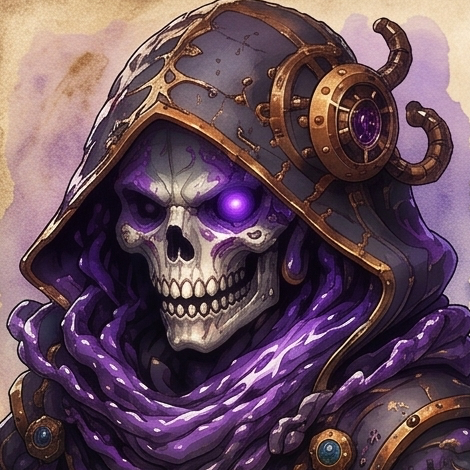
      <h4 style="margin: 8px 0 2px; color: #f8fafc; font-size: 16px;">Buffer Overflow</h4>
      <div style="font-size: 11px; color: #f87171; margin-bottom: 8px;">Sentinela de Fluxo Corrompido</div>
      <div style="display: grid; grid-template-columns: repeat(4, 1fr); gap: 4px; font-size: 10px; background: rgba(0,0,0,0.5); padding: 5px; border-radius: 6px; margin-bottom: 8px; font-weight: 700;">
        <span style="color: #4ade80;">HP 6.5K</span>
        <span style="color: #f87171;">ATK 380</span>
        <span style="color: #38bdf8;">DEF 75</span>
        <span style="color: #fbbf24;">SPD 85</span>
      </div>
      <div style="font-size: 11px; background: rgba(239, 68, 68, 0.12); border: 1px dashed rgba(239, 68, 68, 0.4); padding: 6px; border-radius: 6px; text-align: left;">
        <strong style="color: #fca5a5; display: block; margin-bottom: 2px;">Fundamentos de I/O</strong>
        <span style="color: #cbd5e1; line-height: 1.25; display: block;">Espectro que desestabiliza áreas de memória com correntes arcanas de texto.</span>
      </div>
    </div>
    <!-- Boss 01 -->
    <div style="width: 260px; flex-shrink: 0; background: linear-gradient(180deg, #220e14 0%, #100609 100%); border: 2px solid #ef4444; border-radius: 14px; padding: 14px; text-align: center; color: #fff; box-shadow: 0 10px 25px rgba(239, 68, 68, 0.3);">
      <div style="font-size: 11px; letter-spacing: 1px; color: #ef4444; font-weight: 800; margin-bottom: 6px;">RAID BOSS • CAP. 01</div>
      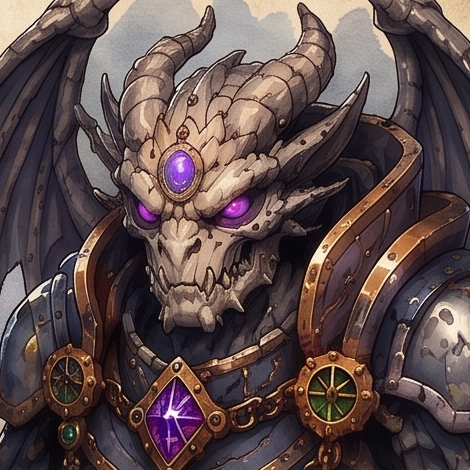
      <h4 style="margin: 8px 0 2px; color: #f8fafc; font-size: 16px;">Gárgula de Tipos</h4>
      <div style="font-size: 11px; color: #f87171; margin-bottom: 8px;">Guardião Petrificado dos Bytes</div>
      <div style="display: grid; grid-template-columns: repeat(4, 1fr); gap: 4px; font-size: 10px; background: rgba(0,0,0,0.5); padding: 5px; border-radius: 6px; margin-bottom: 8px; font-weight: 700;">
        <span style="color: #4ade80;">HP 7.8K</span>
        <span style="color: #f87171;">ATK 400</span>
        <span style="color: #38bdf8;">DEF 90</span>
        <span style="color: #fbbf24;">SPD 88</span>
      </div>
      <div style="font-size: 11px; background: rgba(239, 68, 68, 0.12); border: 1px dashed rgba(239, 68, 68, 0.4); padding: 6px; border-radius: 6px; text-align: left;">
        <strong style="color: #fca5a5; display: block; margin-bottom: 2px;">Tipos Primitivos</strong>
        <span style="color: #cbd5e1; line-height: 1.25; display: block;">Esculpido em granito rúnico, esmaga variáveis instáveis e rejeita casts ilícitos.</span>
      </div>
    </div>
    <!-- Boss 07 -->
    <div style="width: 260px; flex-shrink: 0; background: linear-gradient(180deg, #220e14 0%, #100609 100%); border: 2px solid #ef4444; border-radius: 14px; padding: 14px; text-align: center; color: #fff; box-shadow: 0 10px 25px rgba(239, 68, 68, 0.3);">
      <div style="font-size: 11px; letter-spacing: 1px; color: #ef4444; font-weight: 800; margin-bottom: 6px;">RAID BOSS • CAP. 07</div>
      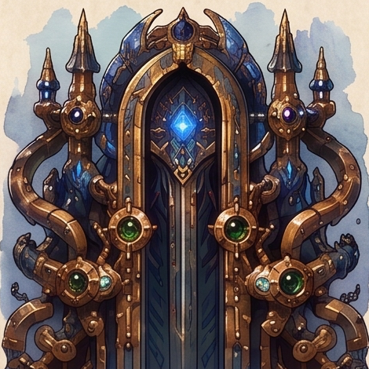
      <h4 style="margin: 8px 0 2px; color: #f8fafc; font-size: 16px;">Monólito de Iteração</h4>
      <div style="font-size: 11px; color: #f87171; margin-bottom: 8px;">Portal dos Passos Finitos</div>
      <div style="display: grid; grid-template-columns: repeat(4, 1fr); gap: 4px; font-size: 10px; background: rgba(0,0,0,0.5); padding: 5px; border-radius: 6px; margin-bottom: 8px; font-weight: 700;">
        <span style="color: #4ade80;">HP 18.8K</span>
        <span style="color: #f87171;">ATK 520</span>
        <span style="color: #38bdf8;">DEF 130</span>
        <span style="color: #fbbf24;">SPD 102</span>
      </div>
      <div style="font-size: 11px; background: rgba(239, 68, 68, 0.12); border: 1px dashed rgba(239, 68, 68, 0.4); padding: 6px; border-radius: 6px; text-align: left;">
        <strong style="color: #fca5a5; display: block; margin-bottom: 2px;">Laço For & Contadores</strong>
        <span style="color: #cbd5e1; line-height: 1.25; display: block;">Estrutura ancestral com tubulações de ouro e cristal que sincroniza passos milimétricos.</span>
      </div>
    </div>
    <!-- Boss 14 -->
    <div style="width: 260px; flex-shrink: 0; background: linear-gradient(180deg, #220e14 0%, #100609 100%); border: 2px solid #ef4444; border-radius: 14px; padding: 14px; text-align: center; color: #fff; box-shadow: 0 10px 25px rgba(239, 68, 68, 0.3);">
      <div style="font-size: 11px; letter-spacing: 1px; color: #ef4444; font-weight: 800; margin-bottom: 6px;">RAID BOSS • CAP. 14</div>
      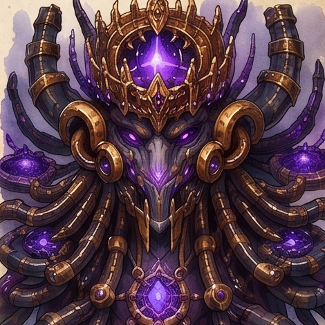
      <h4 style="margin: 8px 0 2px; color: #f8fafc; font-size: 16px;">Soberano da Pilha</h4>
      <div style="font-size: 11px; color: #f87171; margin-bottom: 8px;">Arquidemon da Memória</div>
      <div style="display: grid; grid-template-columns: repeat(4, 1fr); gap: 4px; font-size: 10px; background: rgba(0,0,0,0.5); padding: 5px; border-radius: 6px; margin-bottom: 8px; font-weight: 700;">
        <span style="color: #4ade80;">HP 38.0K</span>
        <span style="color: #f87171;">ATK 720</span>
        <span style="color: #38bdf8;">DEF 170</span>
        <span style="color: #fbbf24;">SPD 125</span>
      </div>
      <div style="font-size: 11px; background: rgba(239, 68, 68, 0.12); border: 1px dashed rgba(239, 68, 68, 0.4); padding: 6px; border-radius: 6px; text-align: left;">
        <strong style="color: #fca5a5; display: block; margin-bottom: 2px;">Ponteiros & Alocação Dinâmica</strong>
        <span style="color: #cbd5e1; line-height: 1.25; display: block;">Anomalia dimensional suprema que corrompe ponteiros e consome memória não liberada.</span>
      </div>
    </div>
    <!-- Clones para rotação contínua e suave -->
    <div style="width: 260px; flex-shrink: 0; background: linear-gradient(180deg, #220e14 0%, #100609 100%); border: 2px solid #ef4444; border-radius: 14px; padding: 14px; text-align: center; color: #fff; box-shadow: 0 10px 25px rgba(239, 68, 68, 0.3);">
      <div style="font-size: 11px; letter-spacing: 1px; color: #ef4444; font-weight: 800; margin-bottom: 6px;">RAID BOSS • CAP. 00</div>
      
      <h4 style="margin: 8px 0 2px; color: #f8fafc; font-size: 16px;">Buffer Overflow</h4>
      <div style="font-size: 11px; color: #f87171; margin-bottom: 8px;">Sentinela de Fluxo Corrompido</div>
      <div style="display: grid; grid-template-columns: repeat(4, 1fr); gap: 4px; font-size: 10px; background: rgba(0,0,0,0.5); padding: 5px; border-radius: 6px; margin-bottom: 8px; font-weight: 700;">
        <span style="color: #4ade80;">HP 6.5K</span>
        <span style="color: #f87171;">ATK 380</span>
        <span style="color: #38bdf8;">DEF 75</span>
        <span style="color: #fbbf24;">SPD 85</span>
      </div>
      <div style="font-size: 11px; background: rgba(239, 68, 68, 0.12); border: 1px dashed rgba(239, 68, 68, 0.4); padding: 6px; border-radius: 6px; text-align: left;">
        <strong style="color: #fca5a5; display: block; margin-bottom: 2px;">Fundamentos de I/O</strong>
        <span style="color: #cbd5e1; line-height: 1.25; display: block;">Espectro que desestabiliza áreas de memória com correntes arcanas de texto.</span>
      </div>
    </div>
  </div>
</div>
</div>

<style>
@keyframes scrollAvatars {
  0% { transform: translateX(0); }
  100% { transform: translateX(-50%); }
}
@keyframes scrollCharacters {
  0% { transform: translateX(0); }
  100% { transform: translateX(-50%); }
}
@keyframes scrollBosses {
  0% { transform: translateX(0); }
  100% { transform: translateX(-50%); }
}
div:hover > div {
  animation-play-state: paused !important;
}
</style>

---

## 💍 4. Sistema de Artefatos, Forja & Transmutação

O ecossistema de equipamentos do **Code Leveler** permite que o jogador customize os atributos do seu Avatar equipando até 4 slots arcanos: **Coroa**, **Cálice**, **Anel** e **Tornozeleira**.

### Catálogo dos 8 Artefatos Oficiais

<div align="center">

| Slot | Artefato | Ícone Oficial SVG | Atributo Principal | Lore & Descrição |
| :---: | :--- | :---: | :---: | :--- |
| **Coroa** | **Diadema do Bastião Cristalino** | 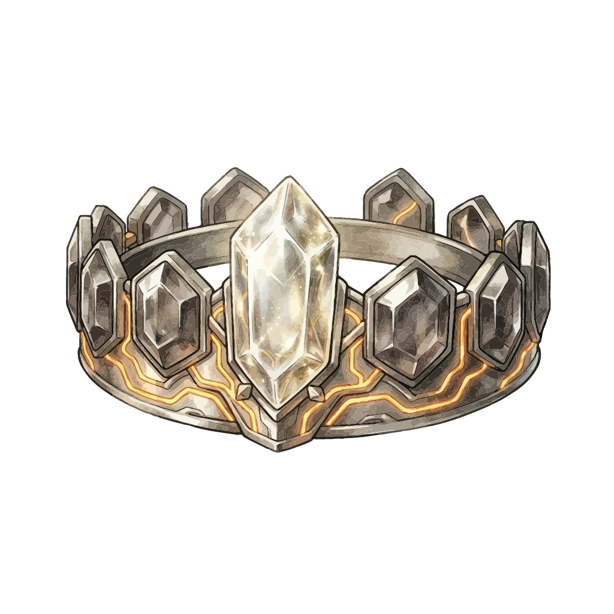 | **Defesa (Fixa)** | Forjado nos cristais profundos de Aethergard, consolida a blindagem física do aprendiz. |
| **Coroa** | **Coroa Oca** | 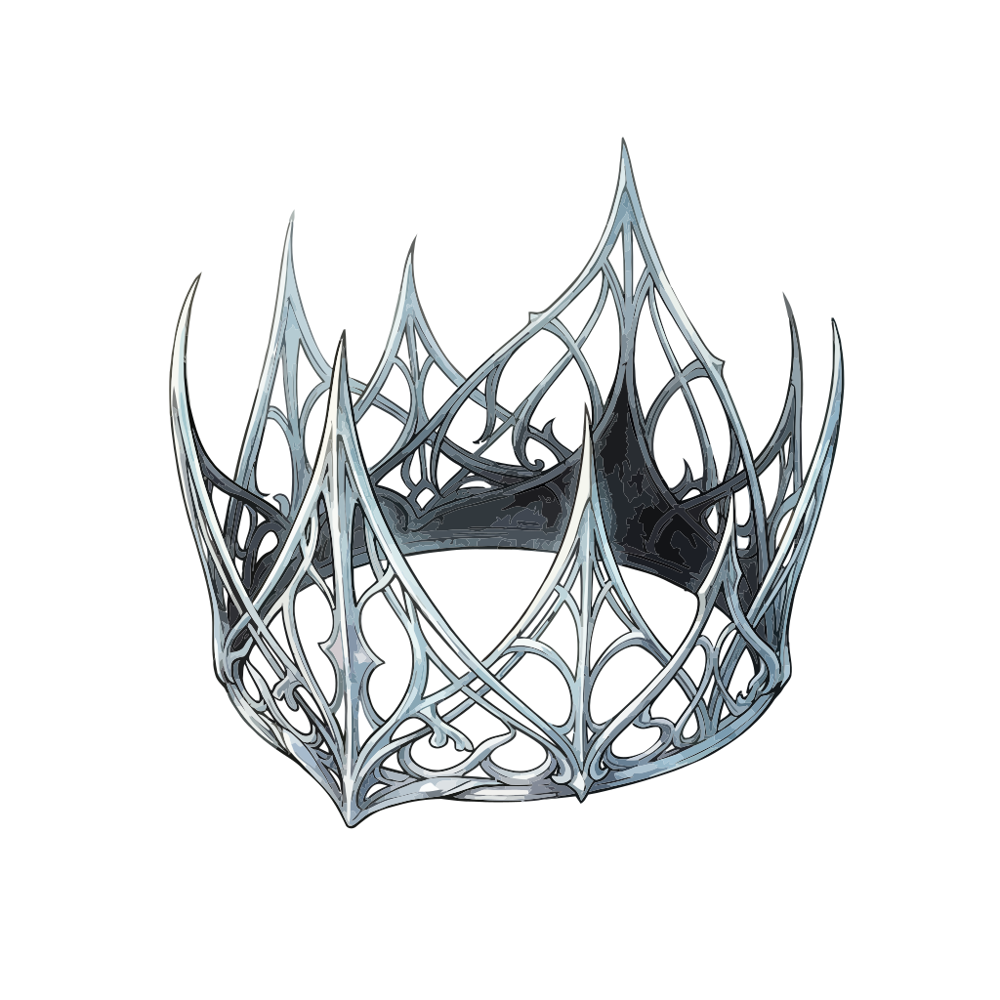 | **Defesa (% Percentual)** | Um diadema espectral que dissipa impactos proporcionalmente à robustez total do usuário. |
| **Cálice** | **Ânfora da Seiva Primordial** | 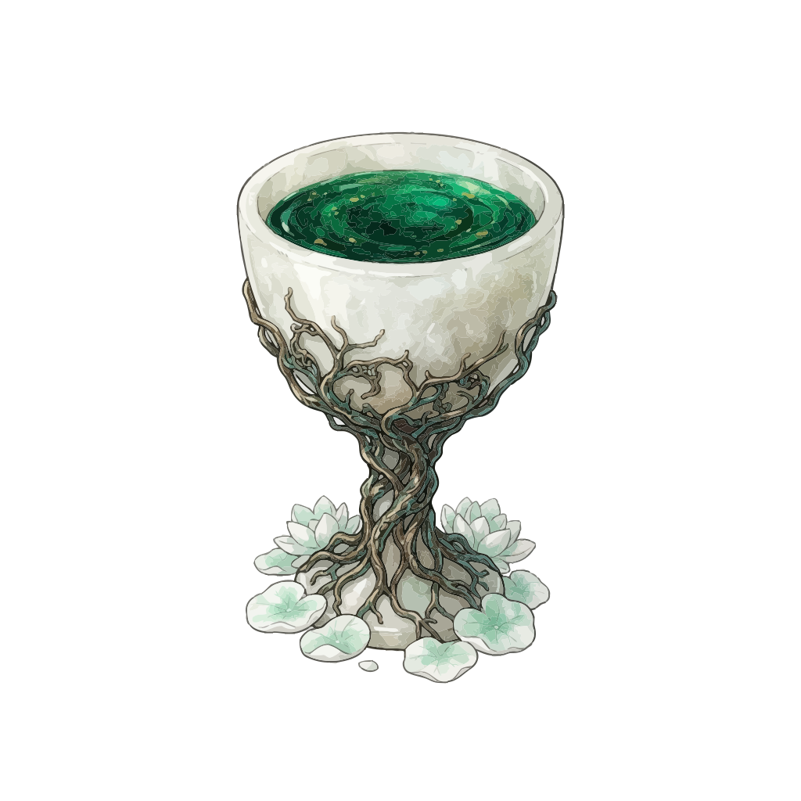 | **Vida (Fixa)** | Contém a essência vital dos nós de memória originais, expandindo a vitalidade base. |
| **Cálice** | **Cálice da Fonte Vulcânica** | 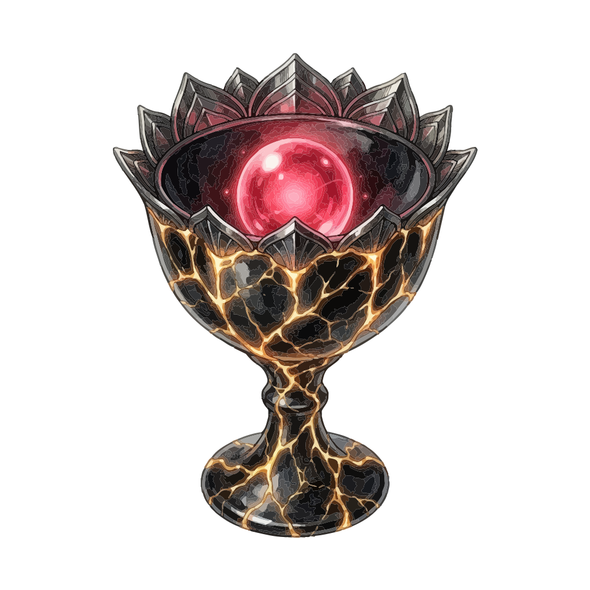 | **Vida (% Percentual)** | Calor incandescente que multiplica o fôlego e a capacidade máxima de sobrevivência. |
| **Anel** | **Anel Dracônico Carmesim** | 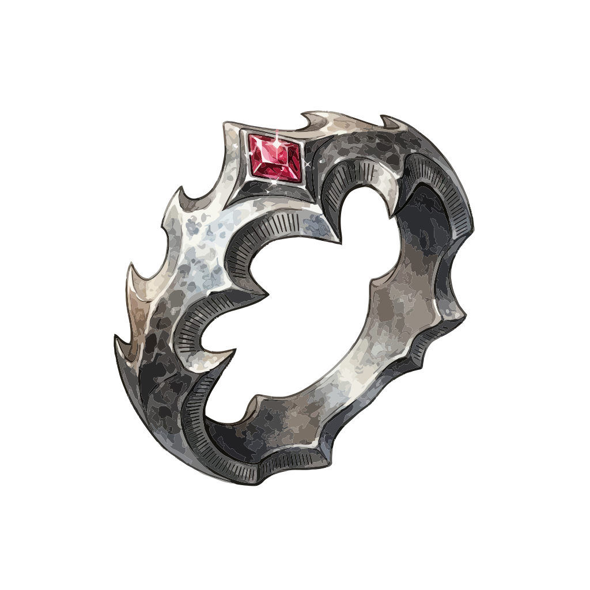 | **Ataque (Fixo)** | Lapidado com escamas dos dragões de dados, adiciona poder ofensivo absoluto aos ataques. |
| **Anel** | **Anel do Ouroboros** | 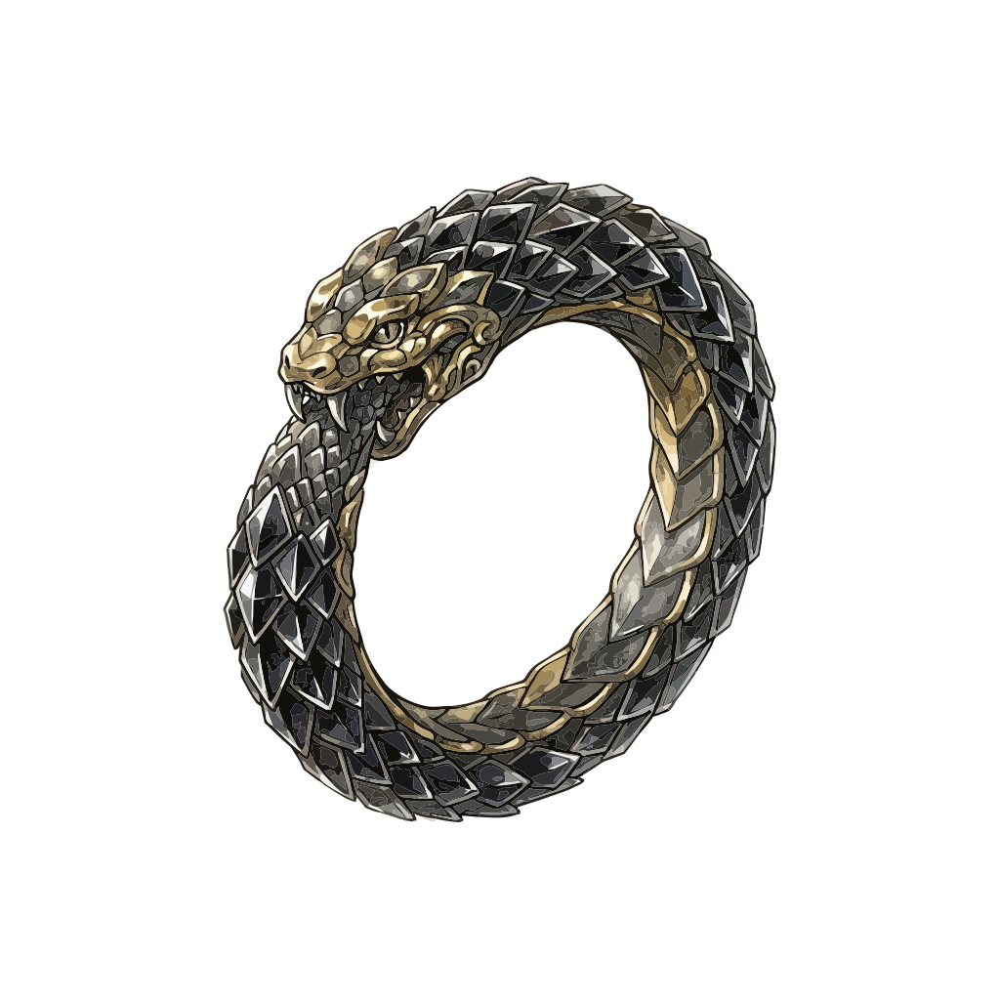 | **Ataque (% Percentual)** | O ciclo infinito de execução amplia a potência de qualquer investida ofensiva. |
| **Tornozeleira** | **Grilhão do Vento Vetorial** | 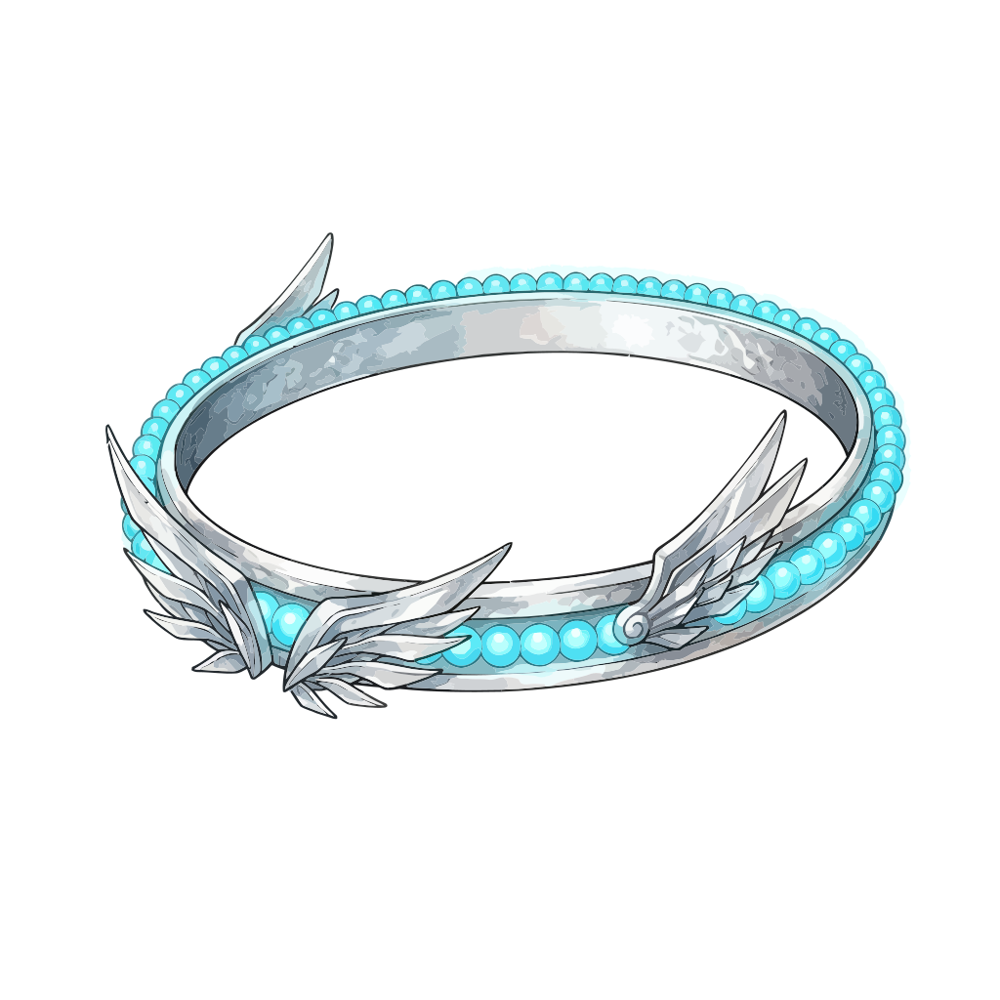 | **Velocidade (Fixa)** | Permite desvios instantâneos e agilidade superior na fila de turnos. |
| **Tornozeleira** | **Elo da Corrente Fulgurante** | 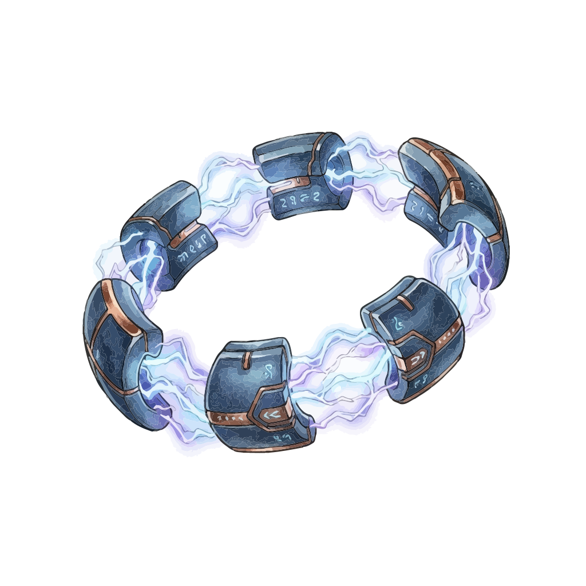 | **Velocidade (% Percentual)** | Impulsos elétricos de clock que multiplicam o tempo de resposta e aceleração tática. |

</div>

---

### Balanceamento por Estrelas, Níveis e Potencial Máximo

Todo artefato obtido inicia no nível **+0** e pode ser aprimorado na **Câmara de Transmutação** consumindo outros artefatos como material e pagando uma taxa em Tokens da Guilda:

| Raridade | Estrelas | Nível Mínimo | Nível Máximo (Cap) | Substatus Aleatórios | Bônus Máximo por Nível | Multiplicador de Potencial | Onde Obter |
| :--- | :---: | :---: | :---: | :---: | :---: | :---: | :--- |
| **Comum** | 3★ | +0 | **+4** | **1 Substatus** | +10% por nível | **+40% de bônus** | Capítulos 00 a 03 / Baús do Abismo F1-F3 |
| **Raro** | 4★ | +0 | **+8** | **2 Substatus** | +10% por nível | **+80% de bônus** | Capítulos 04 a 08 / Baús do Abismo F4-F7 |
| **Épico** | 5★ | +0 | **+12** | **3 Substatus** | +10% por nível | **+120% de bônus** | Capítulos 09 a 13 / Recompensas de Elo PVP |
| **Lendário** | 6★ | +0 | **+16** | **3 Substatus** | +10% por nível | **+160% de bônus** | Chefes de Raid (14-15) & Elo Grand CodeMancer |

---

### Tabela de Faixas de Atributos & Substatus Balanceados

Os substatus são gerados aleatoriamente sem jamais colidir com o atributo primário do artefato e representam de **20% a 35% da grandeza de um atributo primário**:

| Estrelas | Faixa HP (Fixo / %) | Faixa ATK (Fixo / %) | Faixa DEF (Fixa / %) | Faixa SPD (Fixa / %) | Faixa de Substatus (20% a 35%) |
| :---: | :---: | :---: | :---: | :---: | :--- |
| **3★ (Comum)** | 150–280 HP / 4.0–7.0% | 15–28 ATK / 3.5–6.0% | 12–24 DEF / 3.0–5.5% | 5–10 SPD / 2.5–4.5% | HP: +35–65 (ou 1.0–1.8%) • ATK: +4–7 • DEF: +3–6 • SPD: +1–2 |
| **4★ (Raro)** | 300–550 HP / 7.5–12.0% | 30–55 ATK / 6.5–10.5% | 26–48 DEF / 6.0–9.5% | 11–18 SPD / 5.0–7.5% | HP: +70–125 (ou 1.8–3.0%) • ATK: +7–14 • DEF: +6–12 • SPD: +2–4 |
| **5★ (Épico)** | 600–980 HP / 13.0–19.5% | 60–95 ATK / 11.0–16.5% | 52–82 DEF / 10.0–15.0% | 20–30 SPD / 8.0–12.0% | HP: +130–220 (ou 3.0–4.8%) • ATK: +14–24 • DEF: +12–20 • SPD: +4–7 |
| **6★ (Lendário)** | 1.050–1.600 HP / 21.0–30.0% | 105–160 ATK / 17.5–25.0% | 90–140 DEF / 16.0–23.0% | 34–50 SPD / 13.0–18.0% | HP: +230–380 (ou 5.0–7.2%) • ATK: +25–40 • DEF: +22–35 • SPD: +8–12 |

---

### Economia da Transmutação: XP & Custo em Tokens

| Material Consumido | XP Base Concedido | Custo em Tokens | XP Necessário por Nível do Alvo | Total Acumulado até o Nível Máximo |
| :---: | :---: | :---: | :---: | :---: |
| **3★ (Comum)** | **100 XP** | 20 Tokens | **150 XP** por nível (+1 a +4) | 600 XP (+4) |
| **4★ (Raro)** | **250 XP** | 50 Tokens | **300 XP** por nível (+1 a +8) | 2.400 XP (+8) |
| **5★ (Épico)** | **600 XP** | 120 Tokens | **600 XP** por nível (+1 a +12) | 7.200 XP (+12) |
| **6★ (Lendário)** | **1.500 XP** | 300 Tokens | **1.200 XP** por nível (+1 a +16) | 19.200 XP (+16) |

*Nota de Reciclagem Eficiente:* Se o material consumido possuir níveis aprimorados anteriormente, **80% de todo o XP acumulado** nele é transferido como bônus direto para o artefato alvo.

---

## 🏆 5. Arena PVP & Progressão de Elos

Duelos síncronos de algoritmos entre aprendizes, com pontuação, tempos de execução e sistema de patamares competitivos:

| Elo | Faixa de Renome PVP | Como Alcançar |
|---|---:|---|
| **Scriptling** | 0–99 | Elo inicial de todo aprendiz |
| **Code Initiate** | 100–249 | Atingir 100 de Renome |
| **Syntax Adept** | 250–449 | Atingir 250 de Renome |
| **Logic Knight** | 450–699 | Atingir 450 de Renome |
| **Code Master** | 700–999 | Atingir 700 de Renome |
| **Arcane Coder** | 1.000–1.399 | Atingir 1.000 de Renome |
| **Grand CodeMancer** | 1.400–1.899 | Atingir 1.400 de Renome |
| **Legendary CodeMancer** | 1.900+ | Atingir 1.900 de Renome |

---

## 💻 Arquitetura Técnica & Engine

```
                              [ GUILDCODE FRONTEND ]
                      HTML5 + Vanilla CSS + Vanilla JS (ES6+)
                                         │
       ┌─────────────────────────┬───────┴─────────────────┬─────────────────────────┐
       ▼                         ▼                         ▼                         ▼
[ C INTERPRETER ]       [ C# UNITY ENGINE ]       [ WEBAUDIO ENGINE ]       [ FIREBASE CLOUD ]
Execução C99/C11,       Interpretador C# 6.5,     Síntese Sonora Nativa,    Firestore (Sync Realtime),
Validação e Anti-Cheat  Ciclo MonoBehaviour       Efeitos de Chat e Combate  Auth & Sessão Ativa Única
```

- **Interpretador Duplo**: Suporte completo tanto para scripts C puros quanto para classes e métodos C# do Unity (`Debug.Log`, vetores, coleções, classes).
- **Sem Dependências Pesadas**: Carregamento instantâneo, rodando direto no navegador sem necessidade de Node ou frameworks bloated no cliente.
- **Web Audio API**: Síntese senoidal/triangular matemática que gera todos os efeitos sonoros do chat e combate sem pesar na rede.

---

## 🚀 Como Executar Localmente

1. **Clonar o Repositório**:
   ```bash
   git clone https://github.com/rennan101/GuildCode.git
   cd GuildCode
   ```

2. **Abrir a Aplicação**:
   - Abra o arquivo `index.html` em qualquer navegador web moderno.
   - Ou execute um servidor local leve:
     ```bash
     npx serve .
     ```

3. **Compilar Pacote (Opcional)**:
   ```bash
   node js/build.js
   ```

---

<div align="center">
  <sub>Forjado para maximizar a maestria em C e C# Unity. GuildCode © 2026.</sub>
</div>
