<div align="center">


# CODE LEVELER
### *Reencarnei em Outro Mundo e Maximizei Minha Code Skill*

**O MMO Acadêmico de Programação em Linguagem C com Gamificação Profunda, Duelos PVP, Abismo de Algoritmos, Sistema Gacha e Cooperação de Guildas.**

[-00599C?style=for-the-badge&logo=c&logoColor=white)](https://en.wikipedia.org/wiki/C_(programming_language))
[](https://developer.mozilla.org/pt-BR/)
[](https://firebase.google.com/)
[](https://github.com/rennan101/GuildCode)

</div>

---

## 🌟 Visão Geral

**CODE LEVELER** é uma plataforma educacional imersiva que transforma o aprendizado e domínio da **Linguagem C** em uma experiência de RPG de ação no estilo *Solo Leveling*. 

Através da fusão entre narrativa interativa (*Isekai*), interpretador/validador em tempo real no navegador, progressão de patentes, árvores de talentos e interação social em rede, o estudante passa de um simples aprendiz (*Scriptling*) até o patamar de **Legendary CodeMancer**.

<div align="center">
  
</div>

---

## 🎮 Principais Funcionalidades da Plataforma

### 🗺️ 1. Mapa da Ascensão (16 Capítulos Interativos)
- **Campanha Completa de C**: Do básico de entrada/saída (`printf`/`scanf`), condicionais e laços de repetição, até ponteiros arcanos, alocação dinâmica de memória (`malloc`/`free`), structs e árvores binárias.
- **Estrutura Didática em 5 Etapas**:
  1. `01 -- HISTÓRIA`: Diálogos narrativos imersivos com personagens e efeito *typewriter*.
  2. `02 -- CONCEITO`: Explicação teórica condensada e objetiva.
  3. `03 -- EXEMPLO`: Código executável e demonstrativo com saída formatada.
  4. `04 -- EXPERIMENTE`: Laboratório direto no editor para testar variações.
  5. `05 -- ATIVIDADES PRÁTICAS`: Desafios de código avaliados automaticamente por casos de teste.
- **Presença da Guilda no Mapa**: Pins holográficos indicando onde cada colega da turma está explorando em tempo real.

### 🔮 2. Portal de Invocação Gacha & Avatares

- Sistema de invocação de espíritos de código com raridades e habilidades exclusivas.
- **Avatar Inicial Padrão:** todas as novas contas iniciam com o **Neon Coder**.

### 🎴 Avatares — Coleção Completa

O Code Leveler possui **24 Avatares oficiais**, cada um com identidade, raridade, habilidade e atributos próprios. Os atributos abaixo são os **valores base**; HP, Ataque e Defesa finais são escalados pelo Level e pelo Code Power do jogador.

**Raridades atuais:** 5 Lendários, 7 Épicos, 10 Raros e 2 Comuns. As porcentagens de invocação devem ser configuradas separadamente no sistema Gacha; os nomes abaixo representam os Avatares que realmente existem no projeto.

| Ícone | # | Avatar | Raridade | Habilidade | Base HP | ATK | DEF |
|---|---:|---|---|---|---:|---:|---:|
| 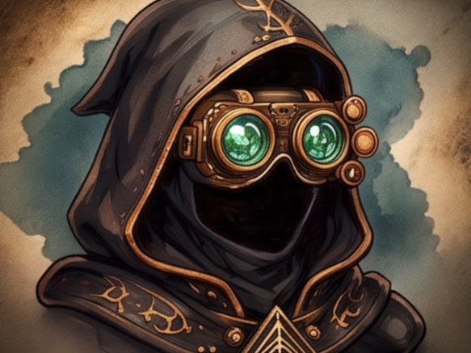 | 01 | **Shadow Coder**<br><sub>Mestre das Sombras</sub> | **LEGENDARY** | **Onisciência do Mestre**<br><sub>Acesso total irrestrito à biblioteca de algoritmos e autoridade de moderação.</sub> | 1250 | 118 | 92 |
|  | 02 | **Neon Coder**<br><sub>Desperto Inicial</sub> | **COMMON** | **Sintonia Neon**<br><sub>+5% de XP em todas as missões concluídas com sucesso na primeira tentativa.</sub> | 980 | 72 | 58 |
|  | 03 | **Code Knight**<br><sub>Paladino da Sintaxe</sub> | **RARE** | **Armadura Sintática**<br><sub>Reduz em 20% a perda de Renome em derrotas no Coliseu PVP.</sub> | 1180 | 84 | 96 |
|  | 04 | **Rune Coder**<br><sub>Inscritor de Glifos</sub> | **RARE** | **Gravação Arcana**<br><sub>Reduz em 20% o custo de Tokens para desbloquear dicas nos capítulos 00 a 05.</sub> | 1040 | 98 | 74 |
| 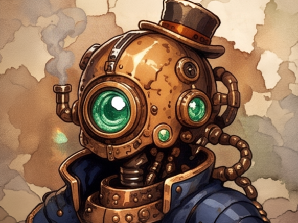 | 05 | **SteamCore**<br><sub>Autômato a Vapor</sub> | **RARE** | **Superaquecimento**<br><sub>+10% de Renome extra ao vencer duelos PVP em menos de 60 segundos.</sub> | 1220 | 88 | 90 |
| 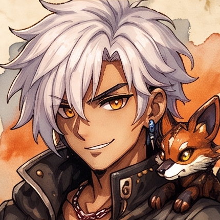 | 06 | **Wild Coder**<br><sub>Rastreador Primitivo</sub> | **COMMON** | **Faro de Tesouro**<br><sub>20% de chance de encontrar +10 Tokens ao submeter desafios de primeira tentativa.</sub> | 1010 | 86 | 60 |
| 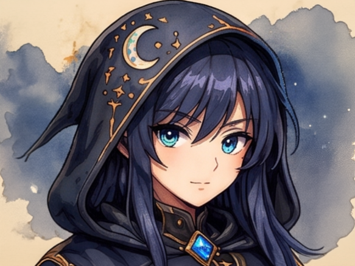 | 07 | **Moon Compiler**<br><sub>Compilador Noturno</sub> | **RARE** | **Refração Noturna**<br><sub>+15% de XP em missões resolvidas durante a noite ou finais de semana.</sub> | 1080 | 94 | 78 |
|  | 08 | **Gearhead**<br><sub>Mecânico de Memória</sub> | **COMMON** | **Engrenagens de Ouro**<br><sub>+4 Tokens da Guilda extras em cada missão de capítulo ou do Abismo concluída.</sub> | 1100 | 74 | 82 |
| 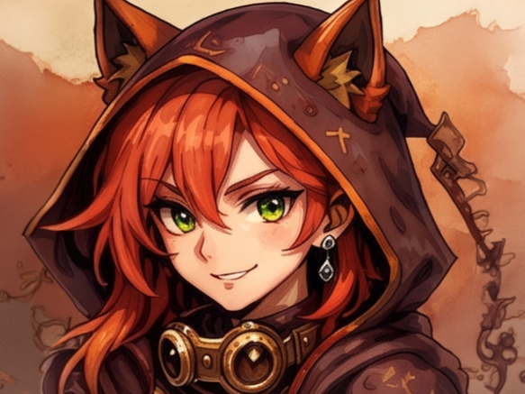 | 09 | **Fox Coder**<br><sub>Espírito Astuto</sub> | **RARE** | **Astúcia da Raposa**<br><sub>20% de chance de duplicar os Tokens obtidos sem consultar dicas.</sub> | 990 | 108 | 68 |
|  | 10 | **Code Prince**<br><sub>Herdeiro Real</sub> | **EPIC** | **Herança Real**<br><sub>+30 segundos adicionais de tempo limite nas Masmorras do Abismo.</sub> | 1160 | 104 | 84 |
| 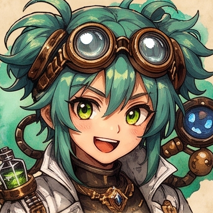 | 11 | **Bug Alchemist**<br><sub>Transmutador Lógico</sub> | **RARE** | **Transmutação Lógica**<br><sub>Converte cada 150 XP ganhos em +15 Tokens adicionais.</sub> | 1030 | 100 | 76 |
|  | 12 | **Dragon Coder**<br><sub>Conjurador Dracônico</sub> | **EPIC** | **Fôlego do Dragão**<br><sub>+12% de multiplicador em ações de dano de subclasses no PVP.</sub> | 1210 | 112 | 86 |
| 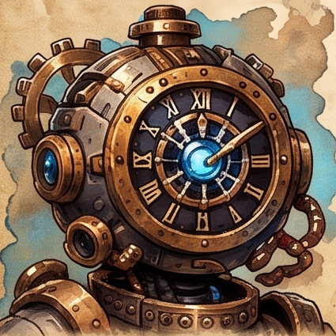 | 13 | **ChronoBot**<br><sub>Guardião do Tempo</sub> | **EPIC** | **Retorno Temporal**<br><sub>Concede 1 recarga diária para reiniciar Masmorras do Abismo sem penalidade.</sub> | 1080 | 102 | 98 |
| 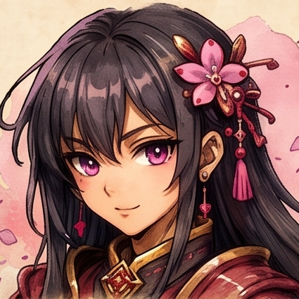 | 14 | **Sakura Coder**<br><sub>Florescer da Mente</sub> | **RARE** | **Pétalas da Calma**<br><sub>Protege a Ofensiva Diária contra 1 dia de ausência na semana.</sub> | 1060 | 90 | 88 |
| 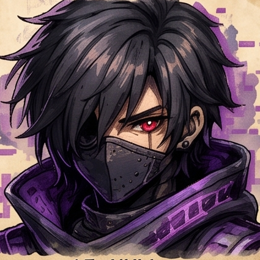 | 15 | **NULL**<br><sub>Anomalia Dimensional</sub> | **EPIC** | **Apagão de Ponteiro**<br><sub>Imunidade ao primeiro erro de execução em dungeons do Abismo.</sub> | 1140 | 110 | 82 |
|  | 16 | **Princess.exe**<br><sub>Comandante Nobre</sub> | **EPIC** | **Comando Soberano**<br><sub>Colegas na mesma Party recebem +5% de XP compartilhado passivamente.</sub> | 1180 | 96 | 94 |
| 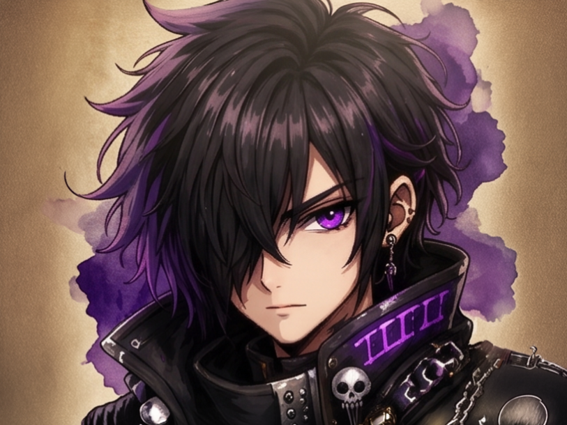 | 17 | **Void Caster**<br><sub>Invocador do Vazio</sub> | **EPIC** | **Sifão do Vazio**<br><sub>Converte 10% da pontuação do adversário derrotado no PVP em Tokens.</sub> | 1020 | 116 | 72 |
| 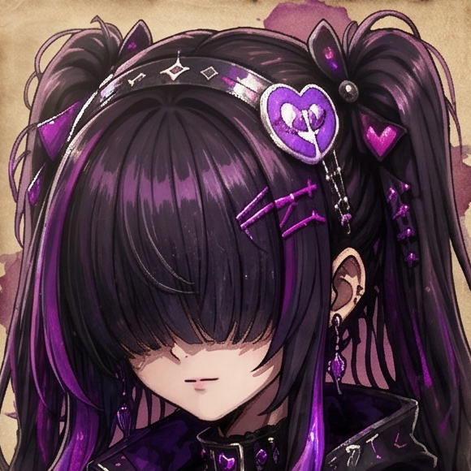 | 18 | **Dark Loli**<br><sub>Maga do Abismo</sub> | **EPIC** | **Pacto Obscuro**<br><sub>+25% de XP em desafios do Abismo com 2 ou mais restrições ativas.</sub> | 1000 | 120 | 70 |
| 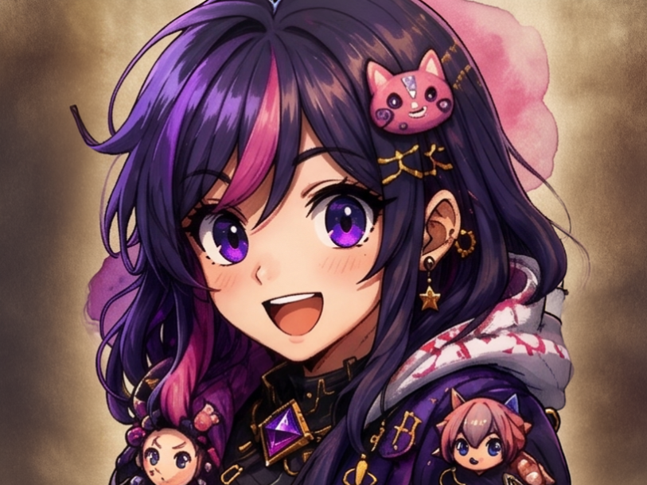 | 19 | **Otaku Chan**<br><sub>Entusiasta Extrema</sub> | **RARE** | **Hiperfoco**<br><sub>Aumenta o multiplicador de XP da Ofensiva Diária em +0.2x a cada 5 dias.</sub> | 1040 | 92 | 84 |
|  | 20 | **Senpai Caster**<br><sub>Mentor Veterano</sub> | **EPIC** | **Tutela Inspiradora**<br><sub>Concede 1 dica gratuita no primeiro desafio do dia.</sub> | 1120 | 98 | 92 |
|  | 21 | **Stack Witch**<br><sub>Arquimaga da Pilha</sub> | **LEGENDARY** | **Magia de Pilha Infinita**<br><sub>+20% de Tokens em desafios que utilizam Ponteiros e Structs.</sub> | 1100 | 122 | 88 |
| 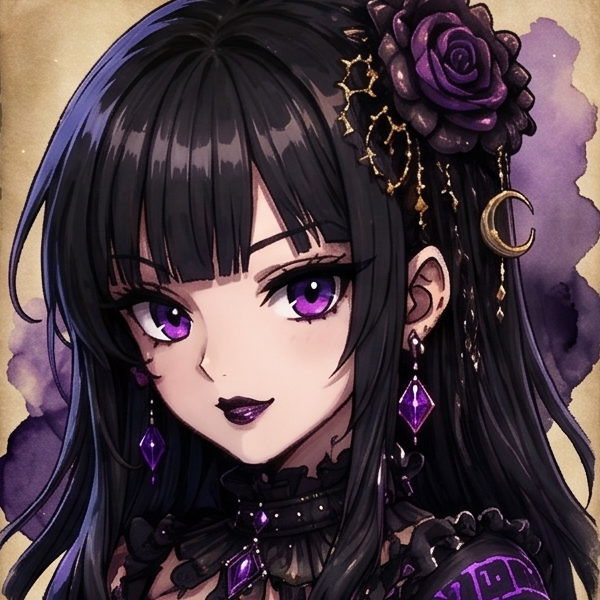 | 22 | **Nightwitch**<br><sub>Bruxa da Meia-Noite</sub> | **LEGENDARY** | **Sombra Lunar**<br><sub>Reduz o tempo de recarga de habilidades de subclasse em 20% em duelos.</sub> | 1070 | 118 | 94 |
| 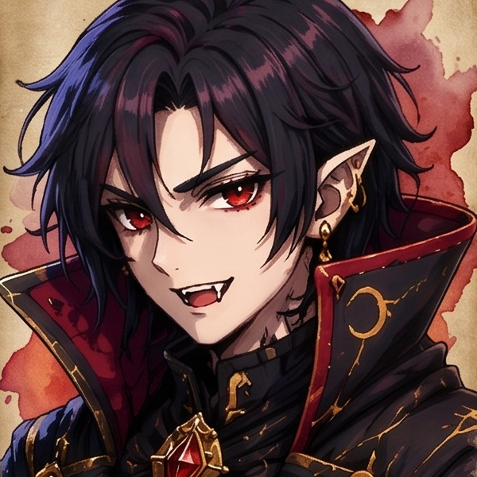 | 23 | **Nightblood**<br><sub>Ceifador Rubro</sub> | **LEGENDARY** | **Grito Carmesim**<br><sub>+25% de pontuação no PVP nos últimos 45 segundos.</sub> | 1160 | 120 | 90 |
|  | 24 | **Loremaster**<br><sub>Guardião do Grimório</sub> | **LEGENDARY** | **Onisciência de Aethelgard**<br><sub>+10% em todos os ganhos do jogo e borda dourada exclusiva.</sub> | 1200 | 114 | 100 |

#### Escala de atributos

Os valores da tabela são deliberadamente diferentes entre os Avatares para permitir estilos de jogo distintos. O sistema de combate deve calcular os atributos finais a partir de:

```text
Level
+ Code Power
+ Subclasse
+ Buffs / efeitos temporários
+ modificadores específicos do Avatar
```

O Avatar não deve ser considerado automaticamente melhor apenas por possuir maior raridade: raridade representa exclusividade e habilidades/passivas, enquanto os atributos devem permanecer balanceados.


### 🏆 3. Arena PVP & Duelos de Código Ranqueados

Duelos de algoritmo e lógica de programação entre aprendizes, com progressão por **Elo** e **Renome PVP**.

#### Como o jogador conquista um Elo

- Todo jogador começa no **Elo mais baixo** ao entrar no PVP ranqueado.
- Cada vitória concede **Renome PVP**.
- Derrotas removem Renome, conforme as regras de proteção da partida e habilidades aplicáveis.
- Ao atingir o mínimo de Renome do próximo Elo, o jogador sobe automaticamente.
- Ao cair abaixo do limite de um Elo, o jogador pode ser rebaixado.
- O matchmaking deve priorizar jogadores de Elo/MMR compatível.
- O Elo é uma representação competitiva; **Level e Code Power não devem substituir o MMR na formação das partidas**.

#### Elos

| Elo | Faixa de Renome PVP | Como alcançar |
|---|---:|---|
| **Scriptling** | 0–99 | Elo inicial do jogador |
| **Code Initiate** | 100–249 | Atingir 100 de Renome |
| **Syntax Adept** | 250–449 | Atingir 250 de Renome |
| **Logic Knight** | 450–699 | Atingir 450 de Renome |
| **Code Master** | 700–999 | Atingir 700 de Renome |
| **Arcane Coder** | 1.000–1.399 | Atingir 1.000 de Renome |
| **Grand CodeMancer** | 1.400–1.899 | Atingir 1.400 de Renome |
| **Legendary CodeMancer** | 1.900+ | Atingir 1.900 de Renome |

**Regra de progressão:** o jogador conquista o Elo ao alcançar sua faixa de Renome. A perda de Renome pode causar rebaixamento, exceto quando uma proteção específica estiver ativa.

#### Recompensas do PVP

As partidas podem conceder:

- Renome PVP;
- XP;
- Tokens da Guilda;
- progresso de ranking;
- recompensas sazonais;
- bônus associados ao desempenho.

O sistema deve registrar vitórias, derrotas, dano/pontuação e evolução de Elo separadamente do progresso PvE.


### 🌀 4. O Abismo do Código
- Duelos de algoritmo e lógica de programação entre aprendizes.
- **Sistema de Tiers & Renome**: De *Scriptling* até *Soberano*.
- Recompensas de **Renome PVP**, **Tokens da Guilda** e **XP**.

### 🌀 4. O Abismo do Código (Endgame & Temporadas)
- Espiral de andares com 5 câmaras desafiadoras em C por andar.
- **Cronômetro de Alta Pressão**: Resolução dentro do tempo limite.
- **Baú do Andar**: Resgate de bônus maciços ao completar as 5 câmaras do andar (+XP, +Tokens e +Renome).

<div align="center">
  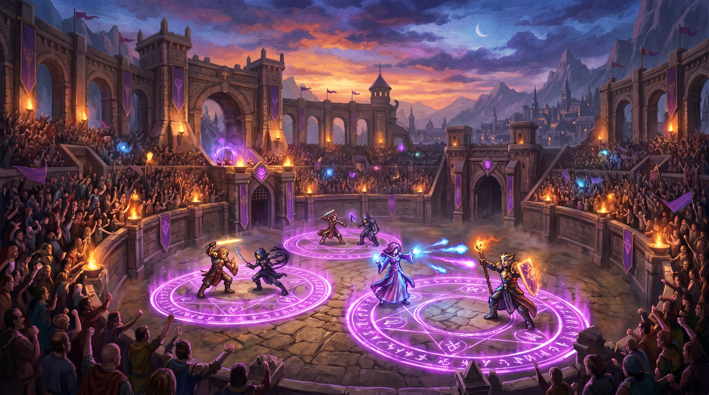
</div>

### ⚡ 5. Árvore de Skills & Despertar de Subclasses (Nível 5+)
Ao atingir o Nível 5, o jogador passa pelo ritual de Despertar escolhendo sua linhagem:
- **Hardcoder**: Foco em tempo de execução veloz, ataque e bônus em sequências de vitória.
- **Analyst**: Redução de custo de recursos, análise lógica profunda e bônus de XP.
- **Debugger**: Resiliência, escudos contra falhas e prevenção de perda de streaks.
- **Reviewer**: Liderança de suporte, amplificação de ganhos de equipe e maestria de código limpo.

### 🛡️ 6. Guildas & Grupos Táticos (Party)
- **Guildas (Turmas)**: Vinculação via código oficial gerado pelo Mestre/Professor com ranking integrado de membros.
- **Party**: Formação de equipes de até 4 aprendizes com bônus cooperativos de XP e Tokens.
- **Mini-Chat Flutuante**: Canal de comunicação em tempo real da Guilda e da Party com expurgo diário inteligente no Firebase.

### 🏆 7. Painel do Professor & Torneios ao Vivo
- Gestão completa de turmas, aprendizes e acompanhamento de progresso.
- Criação e chaveamento de **Torneios ao Vivo** com eliminatórias em tempo real.
- Editor e gerenciador de atividades e câmaras do Abismo integrado.

---

## 🎭 Personagens & Guias de Aethelgard

<div align="center">

| | Personagem | Papel / Função | Descrição |
| :---: | :--- | :--- | :--- |
|  | **GM (Game Master)** | *Guia do Sistema* | Entidade etérea do Sistema que coordena as regras e transmissões arcanas. |
|  | **Arkan Velor** | *Mestre da Guilda* | Líder dos conjuradores marciais. Ensina fundamentos, laços e comandos operacionais. |
|  | **Lyra Nex** | *Arquivista Arcana* | Erudita das matrizes e strings. Decodifica pergaminhos e registros de dados. |
|  | **Kael Thorn** | *Ferreiro de Código* | Mestre da alocação de memória (`malloc`/`free`), ponteiros e otimização de hardware. |
|  | **Mira Solis** | *Cartógrafa Dimensional* | Especialista em navegação de distritos, modularização e estruturas compostas. |
|  | **Orin Vega** | *Mensageiro da Rede* | Guardião das conexões, arquivos e sincronia em tempo real da guilda. |
|  | **Elion Dusk** | *Guardião do Abismo* | Mestre das anomalias complexas, recursão profunda e árvores de busca binária. |

</div>

---

## 💻 Arquitetura Técnica

```
                       [ GUILDCODE FRONTEND ]
                HTML5 + Vanilla CSS + Vanilla JS (ES6+)
                                  │
      ┌───────────────────────────┼───────────────────────────┐
      ▼                           ▼                           ▼
[ C INTERPRETER & ENGINE ]  [ WEBAUDIO & DIALOGUE ]     [ FIREBASE BACKEND ]
  Validação de Sintaxe C,     Sintetizador Sonoro Nativo, Firestore (Sync Real-Time),
  Casos de Teste, Checksum    Transmissão Typewriter      Auth, Single Active Session
```

- **Sem Dependências Pesadas**: Código leve, sem frameworks bloated, com carregamento instantâneo.
- **Web Audio API**: Efeitos sonoros gerados por síntese senoidal/triangular matemática no próprio navegador.
- **Single Active Session**: Controle em tempo real que garante apenas uma sessão ativa por conta, desconectando abas antigas automaticamente.

---

## 🚀 Como Executar

1. **Clonar o Repositório**:
   ```bash
   git clone https://github.com/rennan101/GuildCode.git
   cd GuildCode
   ```

2. **Abrir a Aplicação**:
   - Abra o arquivo `index.html` em qualquer navegador moderno.
   - Ou inicie um servidor local:
     ```bash
     npx serve .
     ```

3. **Começar a Jogar**:
   - Crie uma conta ou entre como Convidado para iniciar a campanha no **Santuário do Despertar**!

---

<div align="center">
  <sub>Forjado para maximizar a maestria em C. GuildCode © 2026.</sub>
</div>
