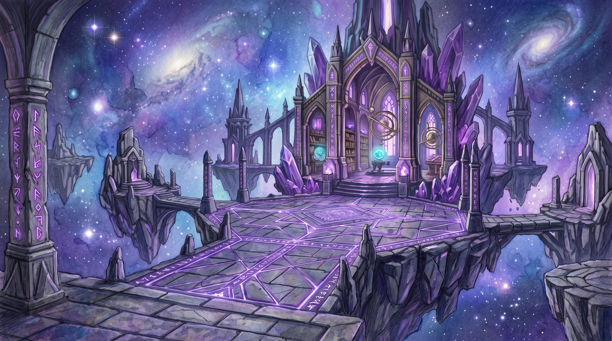
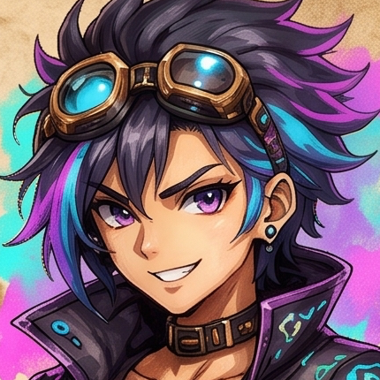
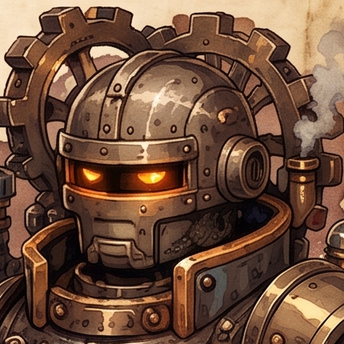
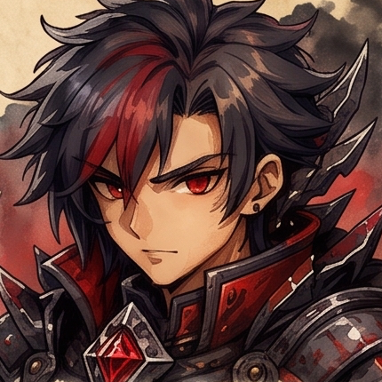
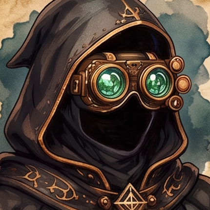
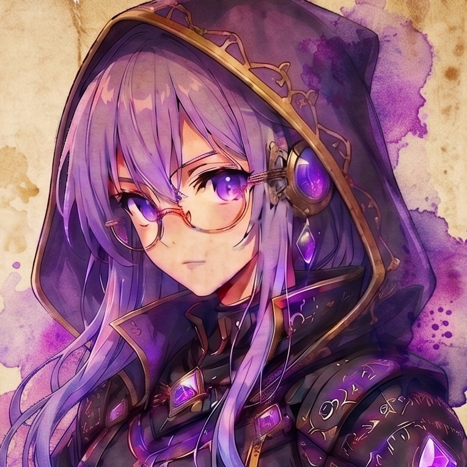
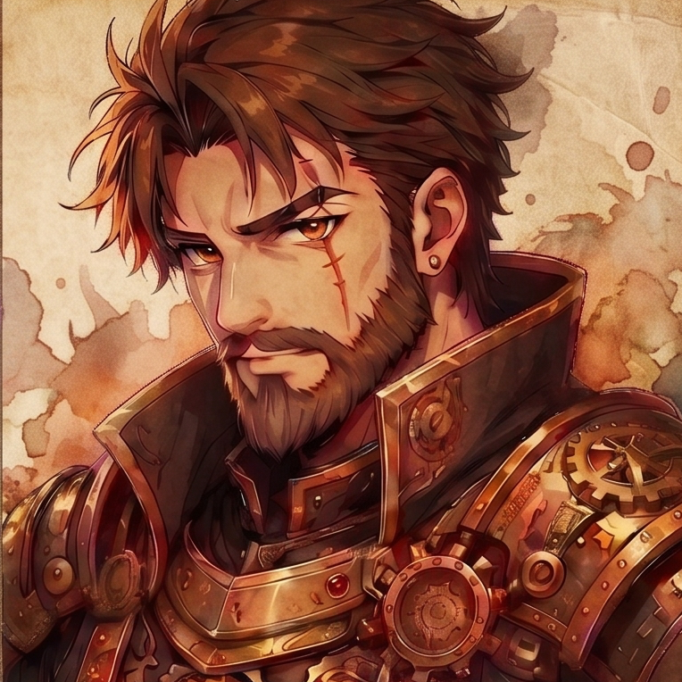
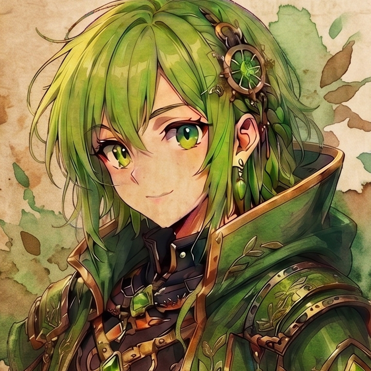
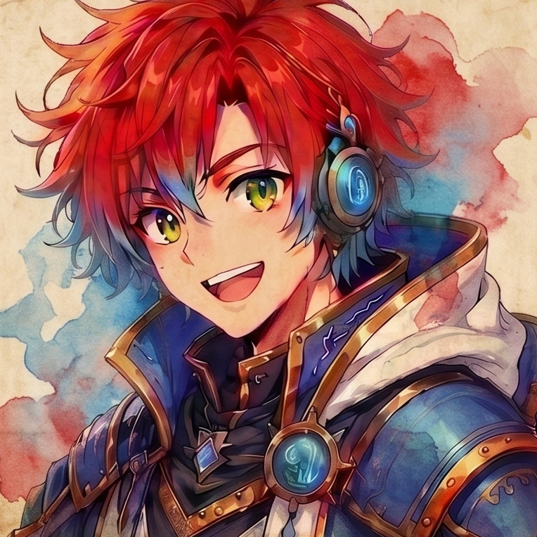
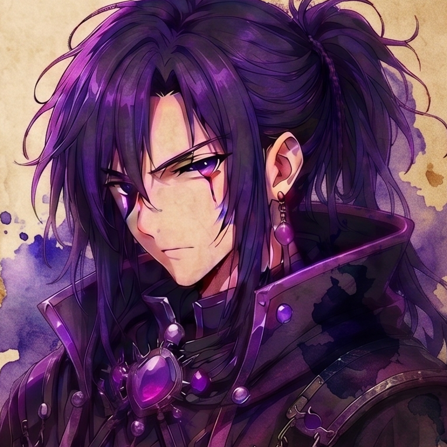

<div align="center">


# CODE LEVELER
### *Reencarnei em Outro Mundo e Maximizei Minha Code Skill*

**O MMO Acadêmico de Programação em Linguagem C com Gamificação Profunda, Duelos PVP, Abismo de Algoritmos, Sistema Gacha e Cooperação de Guildas.**

[-00599C?style=for-the-badge&logo=c&logoColor=white)](https://en.wikipedia.org/wiki/C_(programming_language))
[](https://developer.mozilla.org/pt-BR/)
[](https://firebase.google.com/)
[](https://github.com/rennan101/GuildCode)

</div>

---

## 🌟 Visão Geral

**CODE LEVELER** é uma plataforma educacional imersiva que transforma o aprendizado e domínio da **Linguagem C** em uma experiência de RPG de ação no estilo *Solo Leveling*. 

Através da fusão entre narrativa interativa (*Isekai*), interpretador/validador em tempo real no navegador, progressão de patentes, árvores de talentos e interação social em rede, o estudante passa de um simples aprendiz (*Scriptling*) até o patamar de **Legendary CodeMancer**.

<div align="center">
  
</div>

---

## 🎮 Principais Funcionalidades da Plataforma

### 🗺️ 1. Mapa da Ascensão (16 Capítulos Interativos)
- **Campanha Completa de C**: Do básico de entrada/saída (`printf`/`scanf`), condicionais e laços de repetição, até ponteiros arcanos, alocação dinâmica de memória (`malloc`/`free`), structs e árvores binárias.
- **Estrutura Didática em 5 Etapas**:
  1. `01 -- HISTÓRIA`: Diálogos narrativos imersivos com personagens e efeito *typewriter*.
  2. `02 -- CONCEITO`: Explicação teórica condensada e objetiva.
  3. `03 -- EXEMPLO`: Código executável e demonstrativo com saída formatada.
  4. `04 -- EXPERIMENTE`: Laboratório direto no editor para testar variações.
  5. `05 -- ATIVIDADES PRÁTICAS`: Desafios de código avaliados automaticamente por casos de teste.
- **Presença da Guilda no Mapa**: Pins holográficos indicando onde cada colega da turma está explorando em tempo real.

### 🔮 2. Portal de Invocação Gacha & Avatares
- Sistema cósmico de invocação de espíritos de código com taxas de raridade balanceadas:
  - **Lendário (5%)**: *Nexus Overlord, Quantum Sorcerer, etc.* (+Efeitos visuais e passivas exclusivas).
  - **Épico (25%)**: *Shadow Dev, Cyber Valkyrie, Glitch Reaper, etc.*
  - **Raro (70%)**: *Terminal Scout, Bit Nomad, Byte Monk, etc.*
- **Avatar Inicial Padrão**: Todas as novas contas iniciam com o **Neon Coder** e expandem sua coleção pelo portal.

<div align="center">
  
  
  
  
  
  
</div>

### ⚔️ 3. Arena PVP & Duelos de Código Ranqueados
- Duelos de algoritmo e lógica de programação entre aprendizes.
- **Sistema de Tiers & Renome**: De *Scriptling* até *Soberano*.
- Recompensas de **Renome PVP**, **Tokens da Guilda** e **XP**.

### 🌀 4. O Abismo do Código (Endgame & Temporadas)
- Espiral de andares com 5 câmaras desafiadoras em C por andar.
- **Cronômetro de Alta Pressão**: Resolução dentro do tempo limite.
- **Baú do Andar**: Resgate de bônus maciços ao completar as 5 câmaras do andar (+XP, +Tokens e +Renome).

<div align="center">
  
</div>

### ⚡ 5. Árvore de Skills & Despertar de Subclasses (Nível 5+)
Ao atingir o Nível 5, o jogador passa pelo ritual de Despertar escolhendo sua linhagem:
- **Hardcoder**: Foco em tempo de execução veloz, ataque e bônus em sequências de vitória.
- **Analyst**: Redução de custo de recursos, análise lógica profunda e bônus de XP.
- **Debugger**: Resiliência, escudos contra falhas e prevenção de perda de streaks.
- **Reviewer**: Liderança de suporte, amplificação de ganhos de equipe e maestria de código limpo.

### 🛡️ 6. Guildas & Grupos Táticos (Party)
- **Guildas (Turmas)**: Vinculação via código oficial gerado pelo Mestre/Professor com ranking integrado de membros.
- **Party**: Formação de equipes de até 4 aprendizes com bônus cooperativos de XP e Tokens.
- **Mini-Chat Flutuante**: Canal de comunicação em tempo real da Guilda e da Party com expurgo diário inteligente no Firebase.

### 🏆 7. Painel do Professor & Torneios ao Vivo
- Gestão completa de turmas, aprendizes e acompanhamento de progresso.
- Criação e chaveamento de **Torneios ao Vivo** com eliminatórias em tempo real.
- Editor e gerenciador de atividades e câmaras do Abismo integrado.

---

## 🎭 Personagens & Guias de Aethelgard

<div align="center">

| | Personagem | Papel / Função | Descrição |
| :---: | :--- | :--- | :--- |
|  | **GM (Game Master)** | *Guia do Sistema* | Entidade etérea do Sistema que coordena as regras e transmissões arcanas. |
|  | **Arkan Velor** | *Mestre da Guilda* | Líder dos conjuradores marciais. Ensina fundamentos, laços e comandos operacionais. |
|  | **Lyra Nex** | *Arquivista Arcana* | Erudita das matrizes e strings. Decodifica pergaminhos e registros de dados. |
|  | **Kael Thorn** | *Ferreiro de Código* | Mestre da alocação de memória (`malloc`/`free`), ponteiros e otimização de hardware. |
|  | **Mira Solis** | *Cartógrafa Dimensional* | Especialista em navegação de distritos, modularização e estruturas compostas. |
|  | **Orin Vega** | *Mensageiro da Rede* | Guardião das conexões, arquivos e sincronia em tempo real da guilda. |
|  | **Elion Dusk** | *Guardião do Abismo* | Mestre das anomalias complexas, recursão profunda e árvores de busca binária. |

</div>

---

## 💻 Arquitetura Técnica

```
                       [ GUILDCODE FRONTEND ]
                HTML5 + Vanilla CSS + Vanilla JS (ES6+)
                                  │
      ┌───────────────────────────┼───────────────────────────┐
      ▼                           ▼                           ▼
[ C INTERPRETER & ENGINE ]  [ WEBAUDIO & DIALOGUE ]     [ FIREBASE BACKEND ]
  Validação de Sintaxe C,     Sintetizador Sonoro Nativo, Firestore (Sync Real-Time),
  Casos de Teste, Checksum    Transmissão Typewriter      Auth, Single Active Session
```

- **Sem Dependências Pesadas**: Código leve, sem frameworks bloated, com carregamento instantâneo.
- **Web Audio API**: Efeitos sonoros gerados por síntese senoidal/triangular matemática no próprio navegador.
- **Single Active Session**: Controle em tempo real que garante apenas uma sessão ativa por conta, desconectando abas antigas automaticamente.

---

## 🚀 Como Executar

1. **Clonar o Repositório**:
   ```bash
   git clone https://github.com/rennan101/GuildCode.git
   cd GuildCode
   ```

2. **Abrir a Aplicação**:
   - Abra o arquivo `index.html` em qualquer navegador moderno.
   - Ou inicie um servidor local:
     ```bash
     npx serve .
     ```

3. **Começar a Jogar**:
   - Crie uma conta ou entre como Convidado para iniciar a campanha no **Santuário do Despertar**!

---

<div align="center">
  <sub>Forjado para maximizar a maestria em C. GuildCode © 2026.</sub>
</div>
